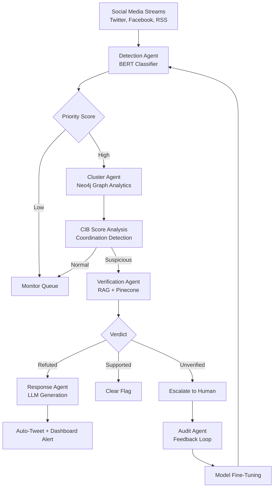

# VerifyNow

A multi-agent AI system for autonomous real-time detection, verification, and response to viral misinformation on social media during crises.

---

## 🎥 Prototype Demo

[](https://www.youtube.com/watch?v=[VIDEO_ID])

> **Note:** Insert your YouTube video ID here to auto-embed the prototype walkthrough.

---

## ✨ Key Features

- **Detects coordinated disinformation** via behavioral analysis and network patterns, beyond isolated post evaluation
- **Multimodal verification** across text, images, audio, and video to combat misinformation in all formats
- **Real-time response** within strict latency requirements to detect false narratives before they spread virally
- **Balanced accuracy** to avoid both false positives (flagging true content) and false negatives (missing harmful misinformation)

---

## 🔄 How It Works

### End-to-End Agentic Architecture

1. **Continuous Monitoring with Detection Agent**
   - Ingests streaming pulls from Twitter (Tweepy), Facebook Graph API, and RSS news feeds through **Apache Kafka**
   - Normalizes text, processes images through OCR, and captions videos with EfficientNet to extract claims
   - Uses fine-tuned **BERT classifier** to identify trends, returning Claim ID and initial score

2. **Behavioral Prioritization with Cluster Agent**
   - Analyzes resharing patterns and account networks using **Neo4j graph database**
   - Applies **Temporal Graph Analytics** to identify coordinated inauthentic behavior (CIB) such as abrupt resharing clusters
   - Uses algorithms like **Connected Components** to determine Coordination Score

3. **Evidence-Grounded Verification with Verification Agent**
   - Performs **Retrieval-Augmented Generation (RAG)** checks for high-priority claims
   - Retrieves from **Pinecone vector store** of reliable sources (Wikipedia, Google Fact Check API)
   - Uses hybrid search (BM25 + semantic), reverse-image search, video frame analysis, and **RoBERTa NLI** to determine if claims are supported, refuted, or unverified with confidence scores

4. **Explainable Response with Response Agent**
   - Generates short, citation-linked corrections and warnings for dashboard and social replies
   - Creates customized outputs through LLMs for auto-tweet responses and dashboard notifications
   - Provides clear, source-supported explanations (e.g., "False: No evidence for this rumor - WHO says X [link]")

5. **Human Feedback and Learning with Audit Agent**
   - Records all system decisions and sends edge cases to human reviewers
   - Enables feedback loop with **reinforcement learning from validated corrections**
   - Continuously fine-tunes agent models for adaptive learning over time

---

## 📊 Workflow Flowchart



---

## 🎯 Target Audience

- **Corporates/PR Firms & Emergency Services** (e.g., Reliance, NDMA) - Brand protection and crisis management
- **Media & Fact-Check NGOs** (e.g., [Alt News](https://www.newsguardtech.com/ai-monitor/august-2025-ai-false-claim-monitor), Boom) - Enhanced verification workflows
- **Election Bodies & Political Campaigns** (e.g., [India's ECI](https://www.npr.org/2024/12/21/nx-s1-5220301/deepfakes-memes-artificial-intelligence-elections)) - Electoral integrity and disinformation defense

---

## 🚀 Go-to-Market Strategy

1. **Freemium launch** via Chrome extension/App Store for journalists (viral via #VerifyIndia on X)
2. **B2B pilots** with PR firms and fact-checking NGOs (e.g., Alt News)
3. **AWS Marketplace expansion** for global enterprise reach
4. **Content marketing** via blogs, webinars, and thought leadership on digital safety

---

## 💰 Revenue Streams

1. **SaaS Subscriptions (70% Revenue)**
   - Freemium: ₹99/month for alerts and basic verification
   - Enterprise: ₹5,000/month for unlimited queries, CIB analytics, and 24/7 support

2. **API Licensing & Data Insights (20% Revenue)**
   - Anonymized threat intelligence reports (CIB patterns, emerging narratives)
   - ₹10,000/report to cybersecurity firms and research institutions

3. **Custom Integrations & Consulting (10% Revenue)**
   - Bespoke dashboards and enterprise deployments
   - ₹2 Lakhs/project for corporate clients

---

## 🌍 Real-World Impact

In a global economy where misinformation costs **$78 billion/year** (IEEE), VerifyNow provides digital risk insurance for democratic institutions and crisis responders. By mitigating election interference (as seen in 2024's AI-enabled influence operations) and reducing crisis-driven chaos, the system safeguards informed decision-making for **500 million+ Indian social media users**. [Learn more about AI-enabled influence operations](https://cetas.turing.ac.uk/publications/ai-enabled-influence-operations-safeguarding-future-elections).

---

## 📁 Project Structure

```
VerifyNow/
├── index.html          # Main prototype dashboard
├── styles.css          # External styles for responsive UI
├── script.js           # Simulation logic and interactivity
└── README.md           # This file
```

> **Note:** This is a static HTML/CSS/JS prototype; no server-side components yet.

---

## ⚡ Quick Start

**No installation required**—pure vanilla HTML/CSS/JS.

1. **Open `index.html` in any modern browser** (Chrome/Firefox recommended)
2. **For development:** Use Live Server extension in VS Code for auto-reload
3. **Simulate workflows** via the Dashboard tab

### Example Workflow

Navigate to the **Live Claim Checker** tab and enter a claim to analyze.

---

## 📝 Examples

### Use Case: Mumbai Flood Rumor

**Scenario:** Viral post claims "Bandra Bridge Collapsed During Monsoon Floods"

**VerifyNow Workflow:**
1. **Detection Agent** flags 340% engagement spike in 15 minutes
2. **Cluster Agent** identifies bot clusters with CIB Score: 0.8 (coordinated resharing)
3. **Verification Agent** cross-references NDMA and Mumbai Police sources - confirms bridge intact
4. **Response Agent** auto-generates correction: "❌ False: NDMA confirms Bandra Bridge is intact. No structural damage reported. [Official Source]"
5. **Audit Agent** logs decision for continuous learning

### Demo Log

```
Input: "Breaking: Bandra Bridge collapsed due to heavy rains!"

Analysis Pipeline:
├─ Detection: Engagement spike 340% | 2,847 posts in 15 min
├─ Cluster: Bot network 28% | Coordination Score: 0.82
├─ Verification: Cross-checked PIB, NDMA, Mumbai Police
└─ Verdict: FALSE (Confidence: 94%)

Output: 
❌ False: NDMA confirms Bandra Bridge is intact. No collapse reported.
📅 Verified: 18 Oct 2025, 14:23 IST
🔗 Source: https://ndma.gov.in | @MumbaiPolice
```

---

## 🏆 Built for Mumbai Hacks 2025

**Contributions welcome!** | Star ⭐ this repo if you find it useful

---

**Tech Stack:** HTML5, CSS3, Vanilla JavaScript | **Future:** Apache Kafka, Neo4j, BERT, Pinecone, RoBERTa NLI
